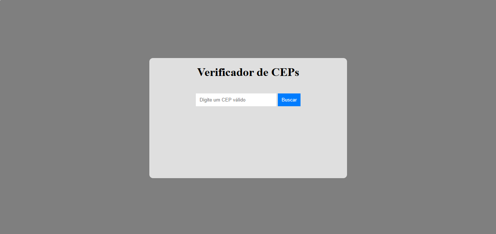

# 🔍 Verificador de CEPs

Este é um projeto simples de uma aplicação web que permite ao usuário buscar informações de um endereço brasileiro a partir de um CEP, utilizando a API pública do [ViaCEP](https://viacep.com.br/).

## 📸 Demonstração

A interface do usuário permite digitar um CEP válido e, ao clicar no botão **"Buscar"**, os dados de endereço são exibidos abaixo.

## 🧩 Tecnologias Utilizadas

- **HTML5** – Estrutura da página
- **CSS3** – Estilização e responsividade
- **JavaScript (Vanilla)** – Lógica de busca e manipulação da API
- **API ViaCEP** – Consulta de dados via `fetch`.